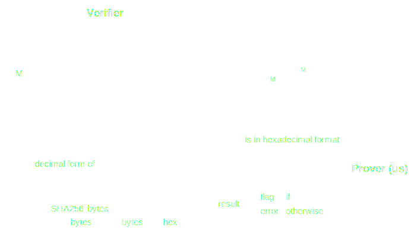
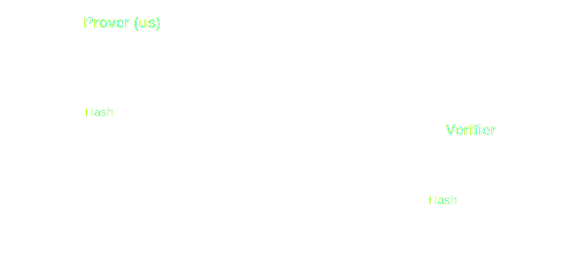

# International Cybersecurity Challenge 2024 - _Samsara_

This challenge was part of the Jeopardy CTF competition in the International
Cybersecurity Challenge 2024 that took place in Santiago, Chile. The topic is
about a weak use of
[LCG](https://en.wikipedia.org/wiki/Linear_congruential_generator) (linear
congruential generator) with the non-interactive
[Girault's proof of knowledge protocol](https://www.zkdocs.com/docs/zkdocs/zero-knowledge-protocols/girault-identification/)
(adapted applying
[Fiat-Shamir transformation](https://www.zkdocs.com/docs/zkdocs/protocol-primitives/fiat-shamir/)).

## Statement

We're given an access to connect to the server and we've its code (without known
the secret message, i.e., the flag). This code contains the
[public server version](./public-server.py). And the objective is get the flag
breaking this verification protocol.

To reduce complexity of understanding this problem, we've to see that this
server has three methods to connect and use as an user: _initialization_,
_rotation_, and _judgement_. To think about it, we can reduce it as independent
smaller subproblems of the same type, where the server executes the methods once
in the order they were mentioned. So, for each part we've this structure:

<h4>
  
  **Initialization module**
</h4>

<!-- prettier-ignore-start -->
&nbsp;&nbsp; **Output**: $n$   
&nbsp;&nbsp; $g = 2$  
&nbsp;&nbsp; $p,q$ random primes with $512$ bits  
&nbsp;&nbsp; $n = pq$  
&nbsp;&nbsp; $a,b,s$ random integer numbers in range $[0,p)$&nbsp;&nbsp; 
&nbsp;&nbsp; $f = x \mapsto (ax + b) \pmod{p}$  
&nbsp;&nbsp; $\textbf{return }n$

<!-- prettier-ignore-end -->

<h4>
  
  **Rotation module**
</h4>

<!-- prettier-ignore-start -->
&nbsp;&nbsp; **Output**: $\text{spins}, \text{states}$   
&nbsp;&nbsp; $\text{spins} = [5,3,23,13,24,6,10,9,7,4,19,16]$  
&nbsp;&nbsp; $\text{states} = [s]$  
&nbsp;&nbsp; $\textbf{foreach } k \in \text{spins }\textbf{do}$ 
&nbsp;&nbsp;|&nbsp;&nbsp; $\textbf{repeat }k\textbf{ times}$ 
&nbsp;&nbsp;|&nbsp;&nbsp;|&nbsp;&nbsp; $s\leftarrow f(s)$ 
&nbsp;&nbsp;|&nbsp;&nbsp; $\text{states} \text{ ++= } [s]$ 
&nbsp;&nbsp; $\textbf{return }\text{spins}, \text{states}$

<!-- prettier-ignore-end -->

<h4>
  
  **Judgement module**
</h4>

<!-- prettier-ignore-start -->
&nbsp;&nbsp; **Input**: $h,u,e,z\in\mathbb{N}\_0 : u,h,z\not\equiv 0\pmod{n} \land e$ is in hexadecimal format  
&nbsp;&nbsp; **Output**: flag or error   
&nbsp;&nbsp; $e_{10}$ is the decimal form of $e$ 
&nbsp;&nbsp; $J_1 = (u == g^z\cdot h^{e_{10}} \pmod{n})$  
&nbsp;&nbsp; $J_2 = (e == \text{SHA256}(\text{bytes}(g) \text{ ++ } \text{bytes}(n) \text{ ++ } \text{bytes}(u)).\text{hex}())$  
&nbsp;&nbsp; $\textbf{if }J_1 \land J_2\textbf{ then}$ 
&nbsp;&nbsp;|&nbsp;&nbsp; $\textbf{return }\text{flag}$ 
&nbsp;&nbsp; $\textbf{else}$ 
&nbsp;&nbsp;|&nbsp;&nbsp; $\textbf{return }\text{error}$

<!-- prettier-ignore-end -->

 
Graphically, this protocol can be seen as:

<h4>
  
  **Samsara's identification protocol**
</h4>

## Solution

We've two main parts in this protocol:

1. Information given by verifier (LCG)
2. Identification protocol

Let see each one in order.

### First part: Information given by verifier

Let us focus in the _Rotation_ method. Since it uses LCG to create random
numbers, this is the weakest part of the system. We doesn't know any term of the
linear function, but we only have some non consecutive terms of the sequence and
its positions. Notice that the position in the sequence of $k$-th value we know,
is $\sum_{i=0}^k M_i$.

Let be $s_k = f^{(k)}(s) = \overbrace{f\circ\dots\circ f}^{k\text{ times}}(s)$
the terms that we've. Then, using the geometric series formula with $a \neq 1$
assumption:

$$
s_k \equiv a^ks+a^{k-1}b+\dots+ab+a \equiv a^ks + b\sum_{i=0}^{k-1}a^i \equiv a^ks+b\frac{a^k-1}{a-1} \pmod{p}
$$

One useful property to use is:

$$
s_A-s_B \equiv (a^A-a^B)\left(s+\frac{b}{a-1}\right) \pmod{p}
$$

An idea to break this LCG and get some information about $n$ is using this last
property, combining it in some form such that the result (without taking modulo)
is a multiple of $p$ and different to zero. If we're able to get some numbers
$R_1,\dots,R_l$ with $l\geq 2$ such that
$R_i\neq 0 \land R_i \equiv 0 \pmod{p}$, we can obtain the value of modulos $p$
with some useful probability.

Let say $T,S$ two of these values. Since $T=pX$ and $S=pY$ for some
$X,Y \in \mathbb{N}$, we know that $gcd(S,T) = p \iff gcd(X,Y)=1$. Therefore,
since the probability that two random numbers are coprime is
$\frac{6}{\pi^2} \approx 0.61$, we've a good probability to get $p$ with a little
quantity of tries.

> [!note]
> More information about the last property can be read in the
> [Wikipedia website](https://en.wikipedia.org/wiki/Coprime_integers#Probability_of_coprimality)
> or, if you want more details, in the
> [Advanced Number Theory with Appications book](https://books.google.com.ar/books?id=6I1setlljDYC&pg=PA220&redir_esc=y#v=onepage&q&f=false).

With that in mind, now we've to think about how to get these $R$-values. Let be
$A,B,C,D,E,F,G,H \in \mathbb{N}\_0$, one way to do that is obtaining these from
$\left\lbrace\sum_{i=0}^k M_i\right\rbrace_{k=0}^{\text{len}(M)}$, such that:

$$
\begin{aligned}
0 &\equiv (s_A-s_B)(s_C-s_D) - (s_E-s_F)(s_G-s_H) &\pmod{p} \\
  &\equiv \left(s+\frac{b}{a-1}\right)^2 \left\[(a^A-a^B)(a^C-a^D) - (a^E-a^F)(a^G-a^H)\right\] &\pmod{p}
\end{aligned}
$$

Since $0 \equiv s+\frac{b}{a-1} \pmod{p}$ is unlikely to happen because $a,b,s$
are random numbers, we want $R = (a^A-a^B)(a^C-a^D)-(a^E-a^F)(a^G-a^H)$ such
that $R\equiv 0 \pmod{p}$ and $R \neq 0$. Expanding terms, the condition for
$A,B,C,D,E,F,G,H\in\mathbb{N}_0$ to hold the equivalence is:

$$
\lbrace A+C,B+D\rbrace = \lbrace E+G,F+H\rbrace,\quad \lbrace A+D,B+C\rbrace = \lbrace E+H,F+G\rbrace
$$

Let be $m = \text{len}(M) + 1 = 13$, then the easier way to get this values from $M$ is
trying all the possibilities with an algorithm $O(m^8)$, i.e., approximately
$2^{29.6}\approx 10^{8.91}$ operations.

However, for a faster way to get them, the idea is to use an $O(m^6)$ algorithm
for average case. The algorithm is:

<h4>
  
  **Get useful exponent combinations**
</h4>

<!-- prettier-ignore-start -->
&nbsp;&nbsp; **Input**: $S = \left\lbrace\sum_{i=0}^k M_i\right\rbrace_{k=0}^{\text{len}(M)}$  
&nbsp;&nbsp; **Output**: $R$ list with all tuples $(A,B,C,D,E,F,G,H)$ that holds the equivalence property.  
&nbsp;&nbsp; $R \leftarrow \emptyset$  
&nbsp;&nbsp; $L \leftarrow \emptyset$ (hash dictionary)  
&nbsp;&nbsp; $\textbf{foreach }(x,y)\in S^2\textbf{ do}$ 
&nbsp;&nbsp;|&nbsp;&nbsp; $L[x+y] \text{ ++= } [(x,y)]$  
&nbsp;&nbsp; $\textbf{foreach }(a,b,c,d)\in S^4\textbf{ do}$ 
&nbsp;&nbsp;|&nbsp;&nbsp; $\textbf{foreach }(e,g)\in L[a+c]\land(f,h)\in L[b+d]\textbf{ do}$ 
&nbsp;&nbsp;|&nbsp;&nbsp;|&nbsp;&nbsp; $\textbf{if }\lbrace a+d,b+c\rbrace == \lbrace e+h,f+g\rbrace\textbf{ then}$ 
&nbsp;&nbsp;|&nbsp;&nbsp;|&nbsp;&nbsp;|&nbsp;&nbsp; $R \text{ ++= } [(a,b,c,d,e,f,g,h)]$ 
&nbsp;&nbsp; $\textbf{return }R$

<!-- prettier-ignore-end -->

> [!note]
> **Why the complexity is $O(m^6)$ for average case?**
> 
> The search over $S^4$ space is $O(m^4)$. Also, the average size for each list
> into $L$ entries is $O(m)$ unless the distribution of $S$ values is such that
> all sums are equal and it isn't like that (however, if it happens, we can put
> a time limit to run). Then, we do another $O(m^2)$ search. Finally, this is why
> the complexity is $O(m^6)$, because $S$ is well distributed.

Since $m=13$, it's faster to get the possible combinations. With the
combinations that generates $R_i$ non zero values, we can get a guess for $p$
prime. The number of final combinations that are useful is $288$. If $p$ isn't
prime, we can run (the problem) again and in a few tries we'll get a prime
value.

With that, we get $p$ and, then, $q = \frac{n}{p}$. I.e., thanks to the weakness
of LCG, we're able to get private primes $p$ and $q$.

### Second part: Identification protocol

In this part, we'll focus in the _judgement_ method. This is a non-interactive
protocol of Girault's proof of knowledge using Fiat-Shamir heuristic where the
prover creates the random $k$-bit challenge $e$ using domain-separated hash
function over $\lbrace g,N,h,u\rbrace$ parameters, as can be seen in the following figure.

<h4>
  
  **Girault's non-interactive protocol**
</h4>

In this specific case of server implementation, $e$ isn't calculated with hash
using all parameters because $h$ isn't used. So, this allows us to do a powerful
attack to trick the verifier and prove that we know the secret $x$ that we,
actually, don't know. The vulnerability is called
[Frozen Heart Vulnerability](https://blog.trailofbits.com/2022/04/14/the-frozen-heart-vulnerability-in-giraults-proof-of-knowledge/).

Our attack is choosing random values for both $u$ and $z$. Then, since $e$ is
calculated without $h$, we compute $e = \text{Hash}(g,N,u)$. Next, we've to find
an $h$ value such that $u \equiv g^z \cdot h^e \pmod{N}$ holds

$$
h \equiv (u \cdot g^{-z})^{e_\text{inv}} \pmod{N}
\qquad\text{where}\qquad
e_\text{inv} \equiv e^{-1} \pmod{\phi(N)}
$$

It works because:
$$g^z \cdot h^e \equiv g^z \cdot \left((u \cdot g^{-z})^{e_\text{inv}}\right)^e \equiv g^z \cdot u \cdot g^{-z} \equiv u \pmod{N}$$

To compute $e_\text{inv}$, we're able to do that easily because we know
$\phi(N)=(p-1)(q-1)$. Also, we've to check existence of this inverse modular by
checking if $\gcd(e,\phi(N))=1$. If it isn't holds, we can try with another
random value $u$ until the hash has this property.

> [!note]
> If we choose $z = \phi(N)$, then $g^z \equiv 1 \pmod{N}$, so
> $u \equiv h^e \pmod{N}$ and we've to compute less things because now
> $h \equiv u^{e_\text{inv}} \pmod{N}$.

Finally, when we send these values to server (verifier), it should give us the
flag message. Then, we break the protocol and solve this challenge.

### Solution implementation

The [complete code and implementation](./solver.py) of the solution works like
that and the only thing to change is the connection, because here is done to try
it locally.
